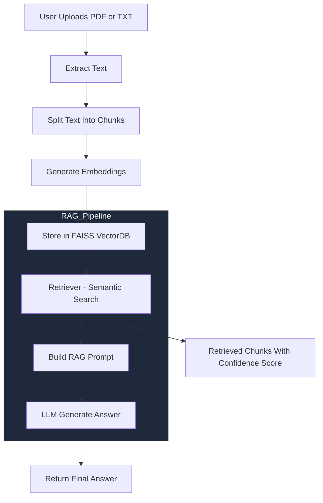

# 🔍 AskMyDocs — AI Document Explorer  
### _Advanced RAG (Retrieval-Augmented Generation) System with Multi-file Support, Dark Mode UI, Semantic Search, Auto Summary, and Document Comparison

AskMyDocs 是一個強大的 **AI 文件理解系統**，支援多檔案上傳、向量化知識庫、RAG 問答、語意搜尋、文件比較、深色模式 UI 等功能。  
適合用於 **課堂專題、作品集、學習 RAG、個人專案 Demo、實習面試展示**。

---

# ✨ Features

## 🚀 Core RAG Functions
- 📄 多檔案上傳（PDF / TXT）
- 🧩 Chunk-based Embedding（LangChain TextSplitter）
- 🔍 FAISS Vector Store（向量資料庫）
- 🤖 RAG 模式問答（LLM + Retriever）
- 🌐 多語言回答（中文 / 英文 / 中英雙語）
- 📌 多種回答風格（Concise, Detailed, Bullet, Exam）
- 📎 來源段落顯示 + Confidence Score

---

## 🔍 Search & Analysis
- 🔎 Semantic Search（語意搜尋，不用 LLM）
- 📊 Document Comparison（文件 A/B 差異比較）
- ✨ Auto Summary（每份文件自動摘要）
- 📁 Chunk 與來源統計

---

## 🎨 UI / UX
- 🌙 Dark Mode 科技風 UI
- ⚙️ Sidebar 設定（Top-K、Temperature、語言、風格…）
- 💬 Chat History（可下載 Markdown）
- 💾 FAISS Local Persistence（向量庫持久化）

---

# 🖼️ Screenshots（可自行補上）
> 建議加入 App UI、Semantic Search、Comparison 截圖

---

# 📁 Project Structure

```
RAG/
├── app.py                 # Streamlit App (Frontend)
├── rag_pipeline.py        # Backend RAG Pipeline
├── requirements.txt       # Dependencies
├── .gitignore             # Ignore env, cache, FAISS DB
├── README.md              # Documentation
└── .env                   # DO NOT COMMIT (API Key)
```

---

# 🧠 System Architecture



---

# ⚙️ Installation

## 1️⃣ Clone project
```bash
git clone https://github.com/YOUR_USERNAME/askmydocs-rag-demo.git
cd askmydocs-rag-demo
```

## 2️⃣ Create `.env`
```env
OPENAI_API_KEY=YOUR_KEY
```

## 3️⃣ Install dependencies
```bash
pip install -r requirements.txt
```

## 4️⃣ Run Streamlit
```bash
streamlit run app.py
```

---

# 🌐 Deploy on Streamlit Cloud

## Step 1 — Push to GitHub  
Push 專案到你的 GitHub repo。

---

## Step 2 — Go to  
👉 https://share.streamlit.io

---

## Step 3 — Create New App  
設定如下：

- **Repo**：your GitHub repo  
- **File**：`app.py`  
- **Python**：3.11  

---

## Step 4 — Add Secrets  
在 Streamlit Cloud → **Settings → Secrets** 加入：

```env
OPENAI_API_KEY="YOUR_KEY"
```

---

## Step 5 — Deploy  
完成後會得到網址：

```
https://askmydocs.streamlit.app
```

---

# 🧪 Usage Guide

## 1️⃣ 上傳 PDF / TXT
- 支援多檔案一次處理  
- 系統會自動讀取並分析內容  

---

## 2️⃣ 自動建立向量資料庫
系統會：

- 自動切 Chunk  
- 自動 Embedding  
- 自動摘要  
- 自動建立 FAISS DB  

---

## 3️⃣ 提問（RAG 問答）
支援：

- 語言切換（中 / 英 / 雙語）  
- 回答風格切換  
- 顯示來源 Chunk、相似度  

---

## 4️⃣ 🔎 Semantic Search
- 不經 LLM  
- 尋找語意最接近的段落  
- 可一次顯示多個結果  

---

## 5️⃣ 📊 文件比較
選擇 **文件 A vs 文件 B** → 系統產生：

- 差異  
- 共通點  
- 結構性比較  

---

## 6️⃣ 💬 匯出對話
可下載成：

- Markdown 檔 (`.md`)  
- 包含 RAG 來源資訊  

---

# 🧩 Tech Stack

| 功能 (Component) | 技術 (Technology) |
|------------------|--------------------|
| **UI** | Streamlit |
| **LLM** | OpenAI GPT-4o-mini |
| **Embedding** | text-embedding-3-small |
| **Vector DB** | FAISS |
| **Orchestration** | LangChain |
| **Backend** | Python |

---

# 🚀 Future Enhancements

- [ ] OCR（圖片與掃描 PDF 辨識）  
- [ ] 支援 DOCX / PPTX  
- [ ] Embedding 3D Visualization（UMAP / PCA）  
- [ ] Milvus / Chroma Cloud Vector Store  
- [ ] Token 使用量分析  
- [ ] Light / Dark Mode 切換  
- [ ] 自動章節 TOC 抽取  
- [ ] 多使用者 Session  

---

# 💙 Credits

Developed with ❤️ by **Kimi**  
If this project helps you, please ⭐ Star the repo!

---

# 📬 Contact

如需：

- 新功能開發  
- README Banner/logo 設計  
- Docker / HuggingFace 部署  
- UI 強化  

歡迎隨時提出！

