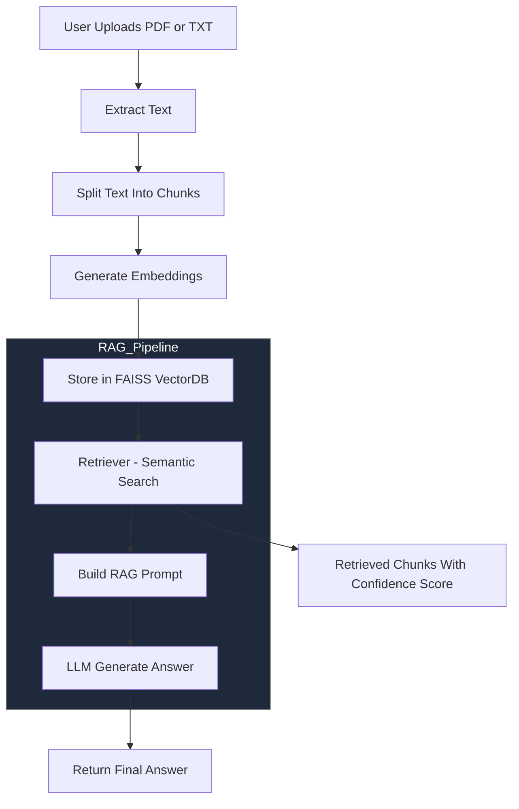

# AskMyDocs – RAG 文件智慧助理系統報告

## 📌 摘要 ABSTRACT
本研究旨在設計並實作一套基於 Retrieval-Augmented Generation（RAG）技術的智慧型文件理解系統——AskMyDocs，以解決傳統大型語言模型（LLM）缺乏文件記憶能力與無法引用來源等問題。系統支援使用者上傳 PDF 與 TXT 等文件格式，透過文本解析、分段（chunking）、向量嵌入與 FAISS 向量資料庫建置，形成可搜尋的知識庫。使用者以自然語言提出問題後，系統會先檢索語意最相關內容，再交由 LLM（GPT-4o-mini）生成回答，使回應更準確、具依據且可追溯。

系統除了核心 RAG 問答外，亦整合文件摘要、自動語意搜尋（Semantic Search）、文件比較、多語言回答、多種回答風格、來源段落與相似度標示、深色模式介面、向量庫持久化與聊天紀錄匯出等功能。整體架構採用 Streamlit 作為前端介面，LangChain 作為後端管線控制元件，OpenAI Embeddings（text-embedding-3-small）負責向量化。實驗結果顯示，本系統能有效協助使用者從多文件中快速擷取關鍵資訊，適合作為學習、研究與知識管理輔助工具，並具備良好的可擴充性。

---

## 📘 1. 研究動機
- 大型語言模型無法主動存取 PDF 或 TXT 內容。
- 純聊天式 LLM 回答缺乏引用來源、無法驗證。
- 全文搜尋僅能比對關鍵字，無法進行語意比對。
- 現代學習與研究需要快速理解大量文件內容的工具。

因此本研究開發 AskMyDocs，透過 RAG 使 AI 真正「讀懂使用者上傳的文件」。

---

## 📘 2. 系統目標
1. 提供多文件上傳與自動知識庫建置。
2. 透過 RAG 提供準確且可追溯的問答機制。
3. 整合文件摘要、語意搜尋、文件比較等高階功能。
4. 具備良好UX：深色模式、側邊控制、多語言等。
5. 保持系統彈性，使其可擴增支援更多格式與場景。

---

## 📘 3. 系統架構

### 3.1 系統流程圖（Mermaid）

---

## 📘 4. 方法與技術說明

### 4.1 文件前處理（Document Preprocessing）
系統首先對使用者上傳的 PDF / TXT 進行解析與前處理，包含：
- **文件解析**：使用 pypdf 與文字解析器讀取原始內容。
- **文本切割（Chunking）**：使用 `RecursiveCharacterTextSplitter` 切割成固定長度 chunk 以利向量化。
- **保存 metadata**：保存來源檔名、chunk 編號、段落位置等資訊。

---

### 4.2 向量化 Embedding（Vector Embedding）
向量化是語意檢索的核心，使用：
- **OpenAI text-embedding-3-small**：高維語意向量模型
- **FAISS**：建立可快速查詢的向量資料庫（支援大量 chunk）

此步驟能將每個 chunk 轉換成可搜尋的語意向量。

---

### 4.3 RAG 問答流程（Retrieval-Augmented Generation）
完整流程如下：

1. 使用者提出問題  
2. Retriever 透過 FAISS 搜尋最相關 chunks  
3. 系統將 chunks 注入 prompt  
4. GPT-4o-mini 生成回答  
5. 回傳答案並附上：  
   - chunk ID  
   - 來源檔名  
   - similarity score  

RAG 讓回答精準且可驗證。

---

### 4.4 語意搜尋（Semantic Search）
Semantic Search 不使用 LLM，而是純向量比對：
- 使用 cosine similarity
- 尋找語意最接近的段落
- 用於快速定位：定義／公式／技術內容／章節重點

是使用者探索文件的重要工具。

---

### 4.5 文件比較（Document Comparison）
系統會分析並產出：
- **Differences（差異）**
- **Similarities（共同內容）**
- **Summary（摘要）**

適合對版本文件、教材或研究草稿進行內容比對。

---

## 📘 5. 系統功能展示（摘要）

- 多檔案上傳  
- 自動建立向量資料庫  
- RAG 問答（附來源 chunk）  
- 語意搜尋  
- 文件比較  
- 多語言 + 多風格回答  
- 深色模式 UI  
- 對話匯出 Markdown  

---

## 📘 6. 實驗與結果

### 6.1 測試文件
- PDF 課堂講義、技術文件與研究筆記  
- 5–15 頁不等  

### 6.2 結果摘要
- RAG 讓回答更正確並具備可追溯性  
- 多語意搜尋（semantic search）可 1 秒內返回結果  
- 文件比較功能能有效顯示差異內容  
- 系統在互動操作上直覺、學習成本低  

---

## 📘 7. 結論
AskMyDocs 結合 RAG、語意檢索、文件摘要與比較等功能，成功打造一套實用的文件智慧助理。系統能快速理解使用者上傳的文件並提供根據來源的精準回答，適用於學習、研究、文件整理等應用情境，並具高度擴展性。

---

## 📘 8. 未來工作
- 支援 OCR（掃描 PDF、圖片文字識別）  
- 支援更多格式（DOCX、PPTX、網頁）  
- 3D Embedding 可視化（UMAP / PCA）  
- 使用 Milvus / Chroma 雲端向量庫  
- Token 使用量與推論成本統計  
- 自動章節分析與 TOC 抽取  
- 支援使用者帳號、個人知識庫  

---

## 📘 9. 參考文獻
- OpenAI API Documentation  
- LangChain Documentation  
- FAISS Similarity Search Library  
- Streamlit Official Documentation  

